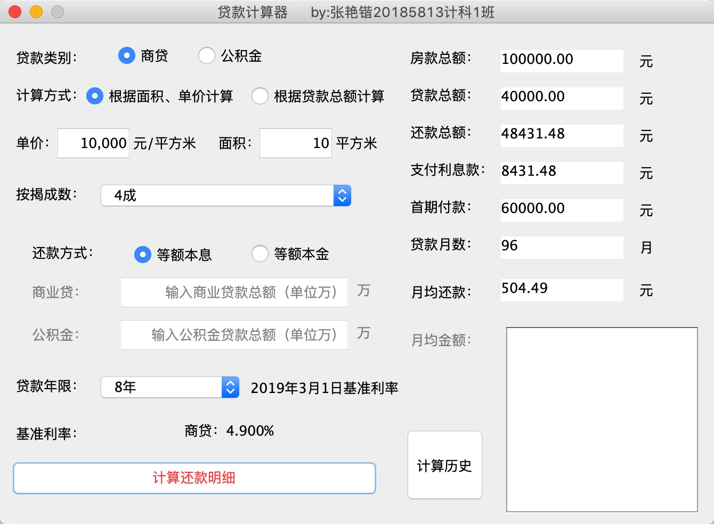
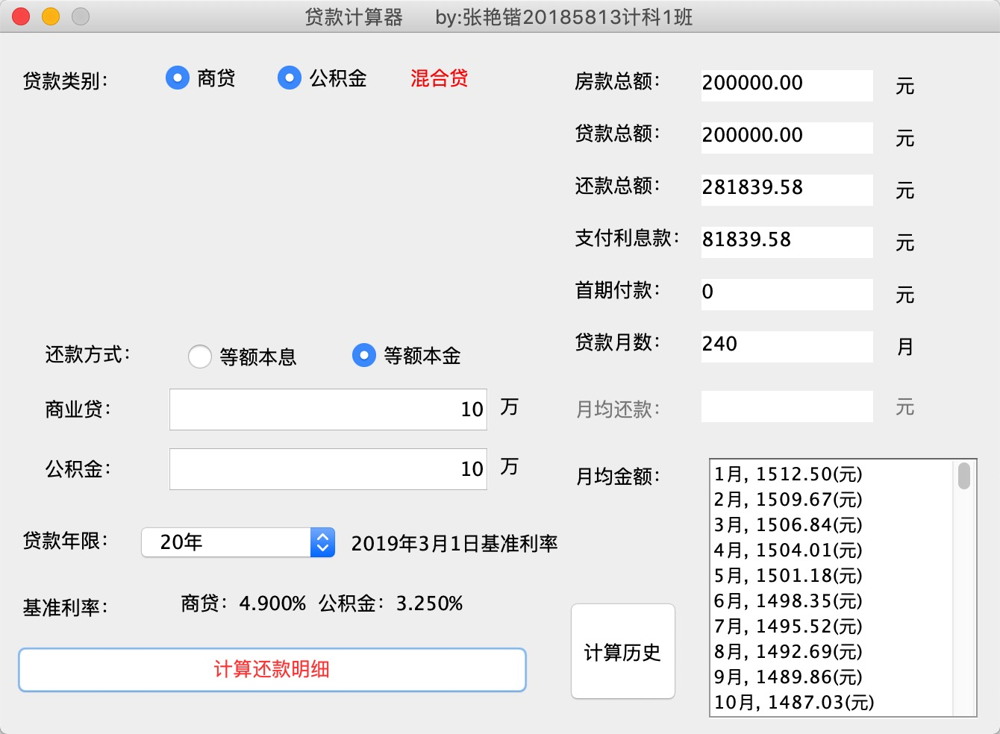
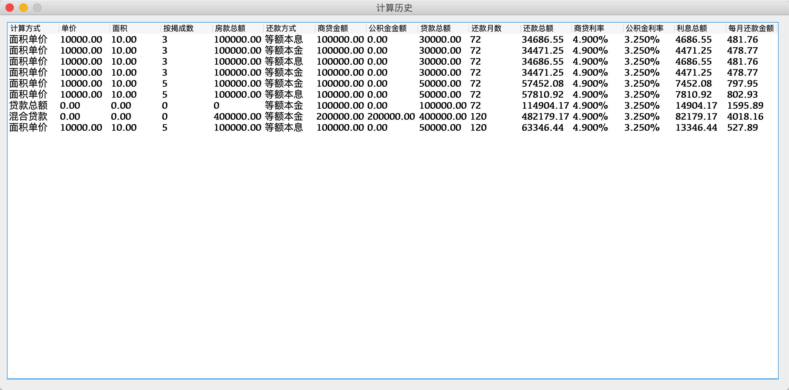

# 基于Java swingGUI的贷款计算器
学习JavaGUI程序设计之后的作品

使用Java设计GUI虽然不是主流操作，但是可以使用swing组件快速开发软件原型，实现基础效果还是不错的

这款贷款计算器是由本人学习并设计开发，功能比较完备的贷款计算器，具有显示计算历史功能，计算结果准确

实例图：

==注：
该程序所得结果仅供研究学习之用，不具备实际参考价值，产生一切后果与作者本人无关。==

